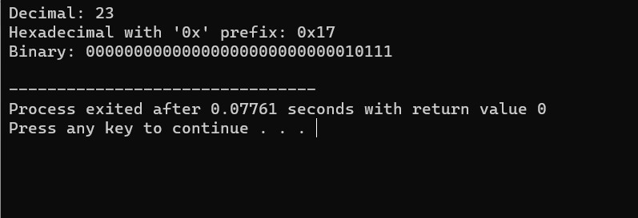
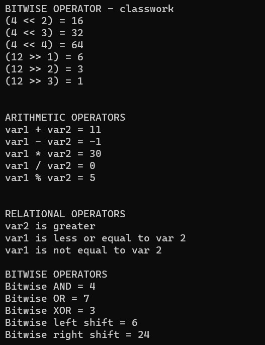

# base

1] [Converting Base](base_cnvrt_bitset.cpp)

This C++ program demonstrates how to print an integer in different representations. It displays the integer var1 in decimal, hexadecimal (with '0x' prefix), and binary formats using the cout stream and manipulators. This is a useful example for understanding how to format and display integer values in various bases.

  

 

2] [Operators](bitwiseoperators.cpp)

This C++ program demonstrates various types of operators, including bitwise, arithmetic, and relational operators. It provides explanations for each operator and displays the results of these operations. This code serves as an educational example of using different operators in C++ for mathematical and logical operations.

  

 
